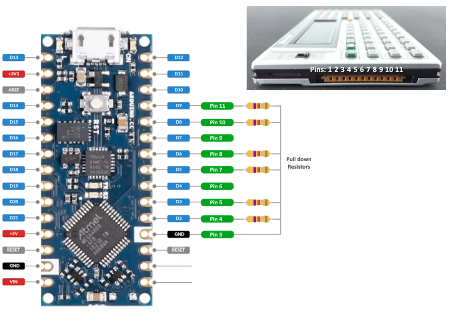

**Sharp Manager** is an application for interfacing some vintage Sharp pocket computers with your Windows desktop PC.  It works together with an [Arduino](https://store.arduino.cc/pages/nano-family) to connect the Sharp computer to a USB port on your computer.  With this hardware and software, Sharp Manager emulates a [CE-126P](http://pocket.free.fr/html/sharp/ce-126p_e.html) cassette and printer interface and a sharp Sharp [CE-140F](http://pocket.free.fr/html/sharp/ce-140f_e.html) floppy drive.  It has only been tested with a Sharp [PC-1401](http://pocket.free.fr/html/sharp/pc-1401_e.html) and a [PC-1403](http://pocket.free.fr/html/sharp/pc-1401_e.html) however the disk emulation should work on any device that supports the CE-140F.

## Requirements

To use this software you will need the following:

* An Sharp Pocket Computer
* An Arduino (Arduino Nano)
* [Sharp Pocket Tools](http://pocket.free.fr/html/soft/pocket-tools_e.html) (Recommended)
* A PC running Windows 10+

## Features

* CE-126P Printer Emulator: Print from your pocket computer to your desktop
* CE-126P Cassette Emulator: Load .tap files into PC-1401 and PC-1403.
* CE-140F Floppy drive Emiulator: Treat a folder on your desktop as a floppy disk.
  
Sharp Manager also supports uploading pre-compiled firmware to a number of different Arduino models.

## Download and Install

You can download the latest release installer from here:

* [Sharp Manager v1.0.1](https://github.com/codaris/SharpManager/releases/download/v1.0.1/SharpManager.msi)

Download the above file and open it to install Sharp Manager on your computer.

## Arduino Connection Diagram

| Arduino Pin | Direction | Sharp Pin | Description       | 
|:-----------:|:---------:|:---------:|-------------------|
|     GND     |           |     3     | Electrical Ground |
|      D2     |   &larr;  |     4     | Busy              |
|      D3     |   &larr;  |     5     | Dout              |
|      D4     |   &rarr;  |     6     | Xin               |
|      D5     |   &larr;  |     7     | Xout              |
|      D6     |   &larr;  |     8     | Din               |
|      D7     |   &rarr;  |     9     | ACK               |
|      D8     |   &larr;  |     10    | SEL2              |
|      D9     |   &larr;  |     11    | SEL1              |

All the pins that are output from the Sharp Pocket computer must be connected to ground with a pull down resistor.  My build uses
480k&#8486; resistors but most values should work.  

## Getting Help

You can get help with this application by using the [Issues](https://github.com/codaris/SharpManager/issues) tab in this project.

## Building the Project

This project consists of two parts, the **Arduino Firmware** that drives the connections to the Sharp Pocket Computer and the **Sharp Manager** desktop application that communicates with the Arduino over USB. 

#### Building the Arduino Firmware

The Arduino firmware is located in the [Arduino](https://github.com/codaris/SharpManager/tree/main/Arduino) directory of the project.  This can be built with the [Arduino IDE](https://www.arduino.cc/en/software) and installed directly onto an Arduino.  For this project, I've chosen an Arduino Nano but most models of Arduino should work without issue.  You can edit the [Sharp.h](https://github.com/codaris/PofoManager/blob/main/Arduino/Sharp.h) file to change the pin mapping if necessary.

#### Building SharpManager

The desktop component is written in C# for .NET 6.0.  It can be compiled by the community (free) edition of [Visual Studio 2022](https://visualstudio.microsoft.com/vs/community/).  Simply open the main solution file in the [SharpManager](https://github.com/codaris/PofoManager/tree/main/SharpManager) directory of the project and select `Build Solution`.

## Acknowledgements

* Norbert Unterberg for reverse engineering the [tape protocol](https://edgar-pue.tripod.com/sharp/files/bigpc/sharplink.html)
* Fabio Fumi for his [Sharp CE-140F emulator for ST-Nucleo](https://github.com/ffxx68/Sharp_ce140f_emul)
* Everyone in the [The Sharp Pocket Computer Faceback group](https://www.facebook.com/groups/sharppc/)
